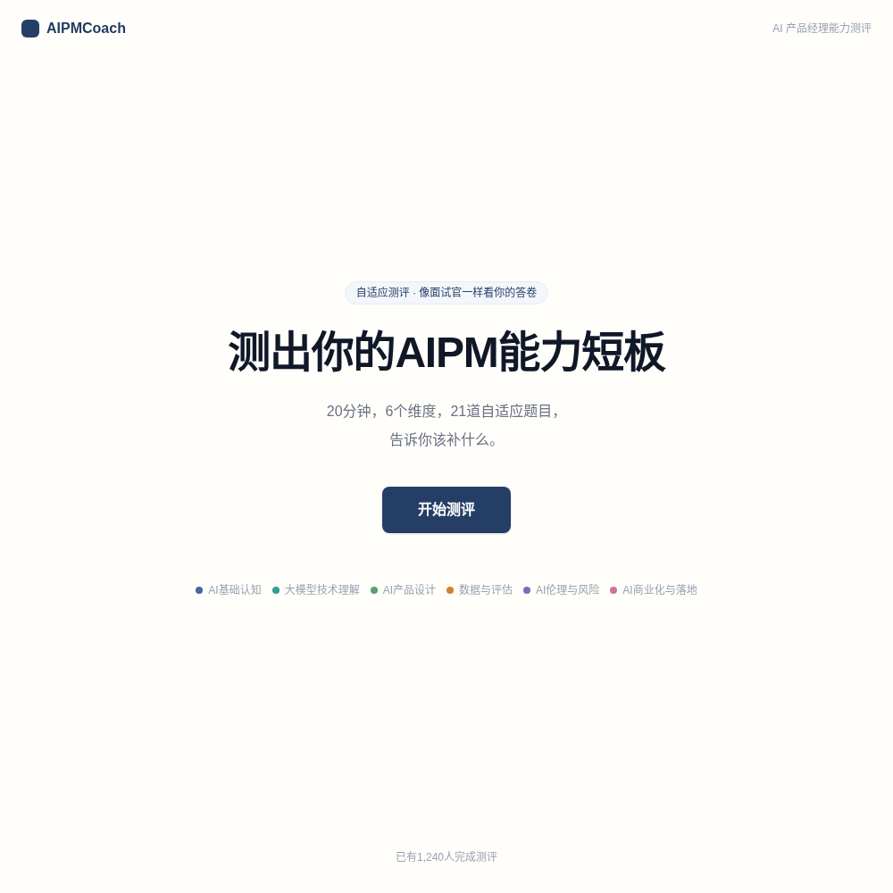
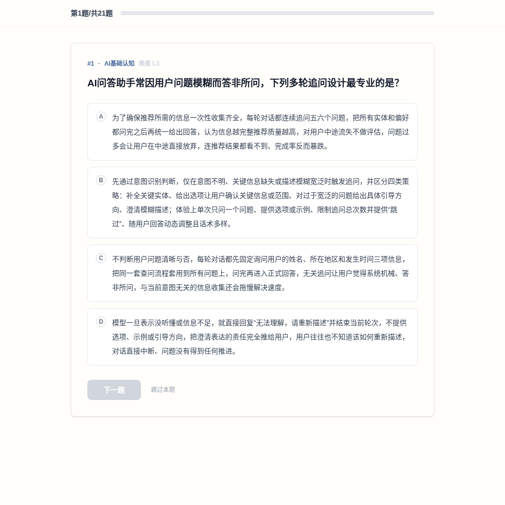
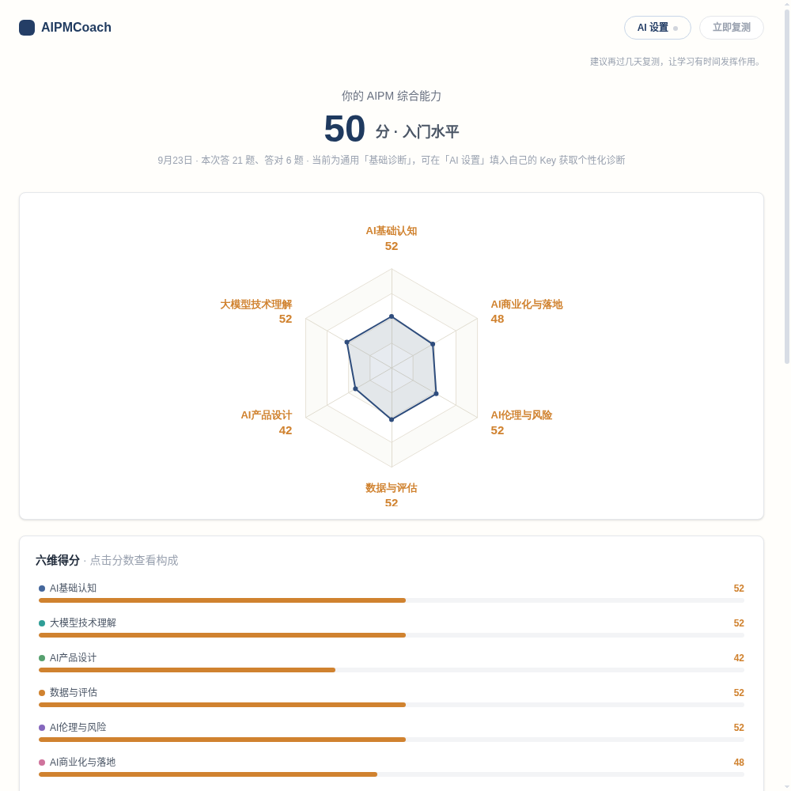
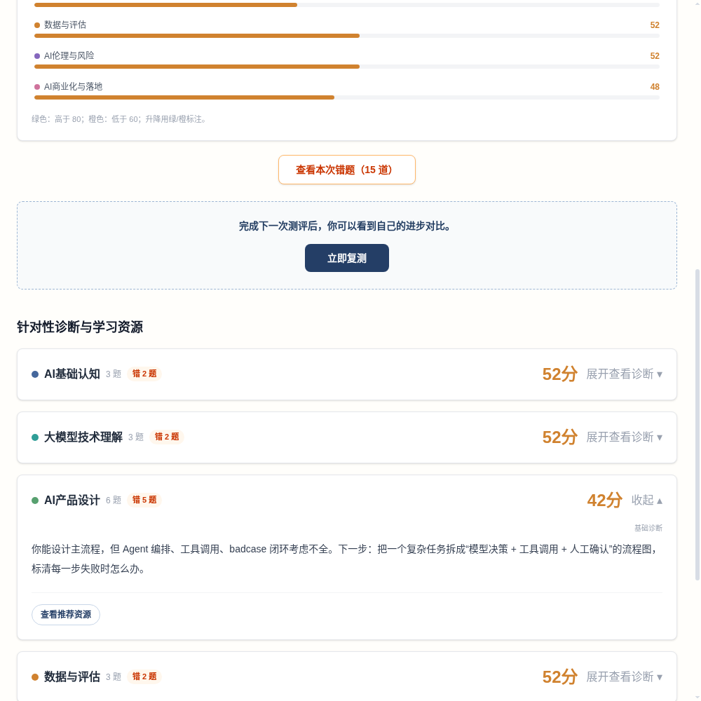

# AIPMCoach · AI 产品经理六维能力自适应测评

[](https://github.com/wuwu-china/AIpm_Coach/actions/workflows/ci.yml)
[](./LICENSE)

> 20 分钟、21 道自适应单选题，测出你作为 AI 产品经理的能力短板，给出**引用具体错题**的 AI 诊断与可自行验证的学习资源。

**🔗 在线体验：[https://aipm-coach.vercel.app](https://aipm-coach.vercel.app)**

---

## 项目截图

| 落地页 | 答题页 |
|---|---|
|  |  |
| **六维雷达结果** | **逐维诊断（含错题角标）** |
|  |  |

## 解决什么问题

想转 AI 产品经理的人通常只凭感觉判断自己"哪里不会"，市面上的测评又是固定一套题、给一句"还有提升空间"的套话。AIPMCoach 做了三件事：

1. **自适应测量**：根据答题者实时对错调整题目难度，把有限题量分配给最薄弱的维度，而不是随机抽题；
2. **可解释的结果**：每个维度分数都能点开看构成（答了几道、各难度对错、逐题计分过程），不是黑箱；
3. **可执行的下一步**：诊断引用答错的具体题号给出原因推测与行动项，并推荐可自行验证来源的学习资源。

## 功能一览

- **简化版 CAT 自适应测评**：难度随对错升降、薄弱维度加测（纯代码实现，确定性、可复现，不依赖任何 AI 做算法决策）。
- **六维能力雷达图**：AI 基础认知 / 大模型技术理解 / AI 产品设计 / 数据与评估 / AI 伦理与风险 / AI 商业化与落地；高分轴线绿色、低分轴线橙色。
- **逐维 AI 诊断**：以资深 AIPM 面试官视角输出「一句话判断 → 错题证据 → 原因推测 → 下一步行动 → 基于答对题目的鼓励」，并强制引用真实题号；进结果页只生成最弱一维，其余点开才生成（懒生成 + 缓存）。
- **学习资源推荐**：刻意**不让大模型输出 URL**（避免幻觉死链），改为给出 3–6 词搜索关键词，一键跳转 Google 搜索，由用户自己验证来源。
- **复测对比与成长曲线**：完成测评自动沉淀能力快照；复测叠加本次/上次雷达，给出总分变化、提升最大维度、仍需加强维度；3 次以上可看六维成长曲线；复测抽题优先避开上次答过的题。
- **错题回看**：结果页可按总览或单个维度查看错题，对比你的选择与正确答案。
- **工程兜底**：AI 调用失败自动重试（1s / 3s）后降级到 24 段预置「基础诊断」；题库就绪门禁、中途关闭可恢复、提交防连点、数据不足不硬诊断。

## 核心设计（技术讲点）

**自适应抽题与计分（`src/lib/cat-engine.ts`）**

- 每个维度维护当前难度（初始 3，答对 +1 封顶 5、答错/跳过 -1 封底 1）与 EWMA 能力分（初始 50）。
- 计分：`新分 = 旧分 × 0.7 + 本题贡献 × 0.3`；贡献分按对错 × 难度分档（答对 L1–L5：55/60/75/90/100；答错：20/30/45/50/60）。
- 阶段一（1–18 题）六维轮询、保底每维 ≥3 题；阶段二（19–21 题）逐题加测当前 EWMA 最低且未掌握的维度；难度档无题时向相邻难度扩散，全程不重复抽题。
- 总分 = 六维 EWMA 等权平均；控制台打印 `[CAT]` 抽题与判分日志，便于观察。

**BYOK（Bring Your Own Key）**

- 应用不内置任何大模型 Key、不产生 token 费用；使用者在「AI 设置」填入自己的 Key，Key 仅保存在其本人浏览器 `localStorage`。
- 请求经同源的无状态 Serverless 中转（`api/chat.ts` Edge Function，本地开发由 Vite 中间件模拟）转发，服务端零 Secret、零配置。
- 不填 Key 也能完整答题与看雷达图，诊断自动走预置兜底文本。

**题库确定性构建**

- 题库真源是 `data/bank.md`（题干、A–D 选项、唯一答案、标签、难度、考核点）；维度由标签**确定性映射**，`npm run build:bank` 生成 `src/data/questions.ts`，当前入池 285 题、结构异常 0、答案分布均衡。
- 构建会自动剔除结构异常题块，坏题不进题库、不中断构建。选项已做长度均衡处理，避免「字多即答案」。

## 技术栈

React 18 + TypeScript + Vite 5 · Tailwind CSS v4 · React Router v6（路由级懒加载）· ECharts 5（按需引入，成长曲线模块懒加载）· 无状态 Serverless 中转 · 无数据库（会话/快照/历史均存 `localStorage`）。

## 本地运行

```bash
npm install
npm run dev        # http://localhost:5173 ，已内置 /api/chat 中转，无需后端
```

其他命令：

```bash
npm run build      # 类型检查 + 生产构建
npm run preview    # 本地预览构建产物
npm run test:cat   # CAT 引擎不变量测试
npm run build:bank # 题库改动后重新生成 src/data/questions.ts
```

## 目录结构

```
├── api/chat.ts                  # 无状态 BYOK 中转（Edge Function）
├── server/relay.mjs             # 中转逻辑（Edge 与本地 dev 共用）
├── data/bank.md                 # 题库真源
├── scripts/build-questions.mjs  # 题库确定性解析构建
├── scripts/smoke-cat.ts         # CAT 引擎不变量测试
├── src/lib/                     # CAT 引擎、AI 客户端、诊断/资源服务、存储
├── src/components/              # 雷达图、成长曲线、错题回看、诊断卡片、AI 设置
└── src/pages/                   # 落地页 / 介绍页 / 答题页 / 结果页
```

## 测试与边界条件

- `npm run test:cat` 覆盖题量、六维保底、不重复抽题、掌握封顶、分数边界、刷新续测、复测避让旧题等不变量；CI 在每次 push / PR 自动运行。
- 人工边界自测清单见 [docs/SELFTEST.md](./docs/SELFTEST.md)（AI 失败降级、题库门禁、中途关闭恢复、空状态、防连点、分数构成等）。
- 题库维护与发版流程见 [docs/MAINTAIN.md](./docs/MAINTAIN.md)。

## 后续规划

- 接入服务端完成人数统计，替换当前前端演示口径；
- 诊断与资源推荐的缓存与 prompt 迭代；
- 专项维度测评模式。

## License

[MIT](./LICENSE)
